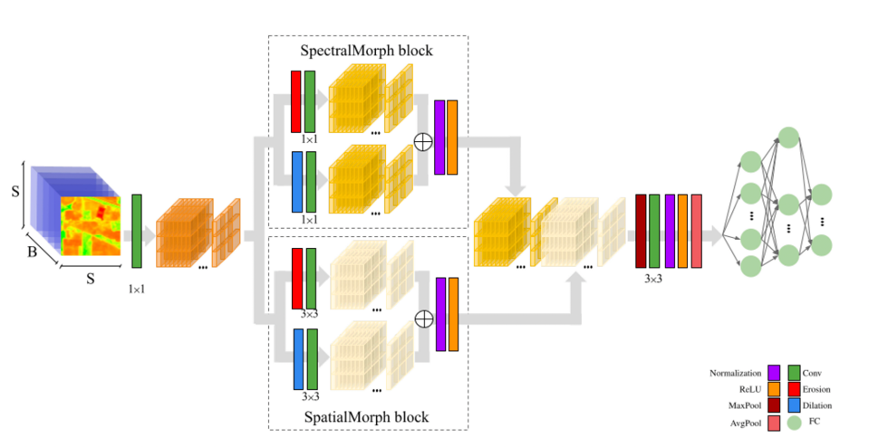

# Inofficial code for MorphConvHyperNet

  

This repository contains the code for "Morphological Convolutional Neural Networks for Hyperspectral Image
Classification".  
[https://ieeexplore.ieee.org/document/9451651]

If you have questions or suggestions, please feel free to open an issue. Please cite as:

```
S. K. Roy, R. Mondal, M. E. Paoletti, J. M. Haut and A. Plaza
Morphological Convolutional Neural Networks for Hyperspectral Image Classification
IEEE Journal of Selected Topics in Applied Earth Observations and Remote Sensing
DOI: 10.1109/JSTARS.2021.3088228
vol. 14, pp. 8689-8702, 2021.
```



And of course, don't forget to gve a star if you find the code useful!

Also consider citing:

```
M. Kukushkin, M. Bogdan and T. Schmid
On optimizing morphological neural networks for hyperspectral image classification
SPIE Sixteenth International Conference on Machine Vision (ICMV 2023)
DOI: 10.1117/12.3023593
p. 49, 2024.
```
